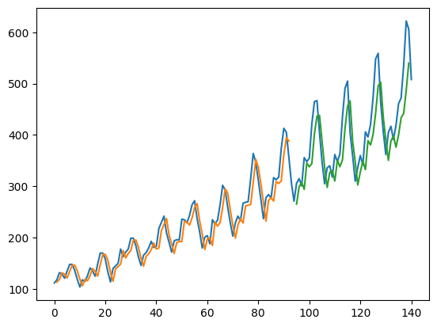

# Time Series Forecasting using LSTM

This project demonstrates how to predict airline passenger trends using a Long Short-Term Memory (LSTM) neural network.

The model is trained on historical airline passenger data and learns time-dependent patterns to forecast future values.

---

## 🔍 Project Overview
- Type: Time Series Forecasting
- Algorithm: LSTM (Deep Learning)
- Language: Python
- Framework: TensorFlow / Keras

---

## 📊 Output
Below is the predicted vs actual passenger trend:

---

## 📁 Files
- `TIME_SERIES_FORECASTING_LSTM.ipynb` – Main notebook  
- `graph.png` – Prediction graph  

---

## 📚 Dataset
Airline Passenger dataset from:
https://github.com/jbrownlee/Datasets

---

## 🚀 How to Run
1. Open the notebook in Google Colab or Jupyter.
2. Run all cells from top to bottom.
3. The model will train and display prediction graph.

---

## ✨ Author
Kalpana Bhardwaj  
BTech CSE (AI & ML)
